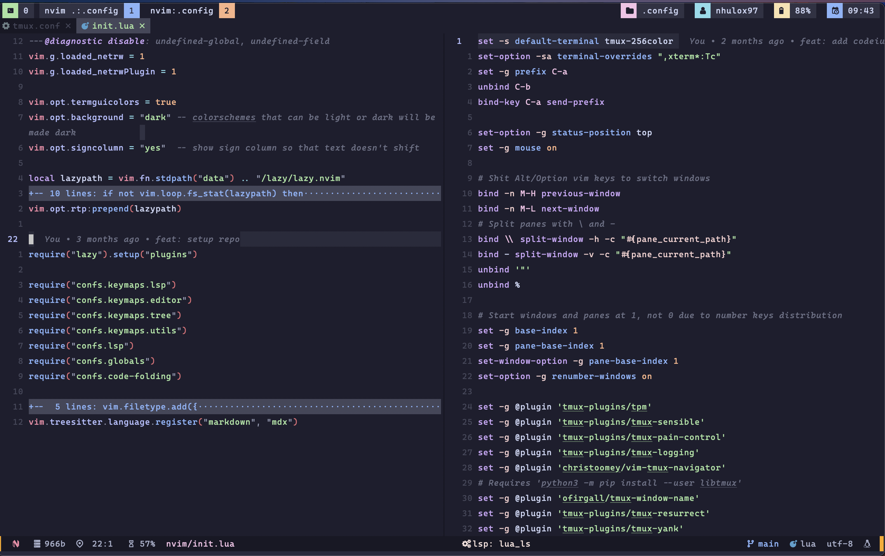
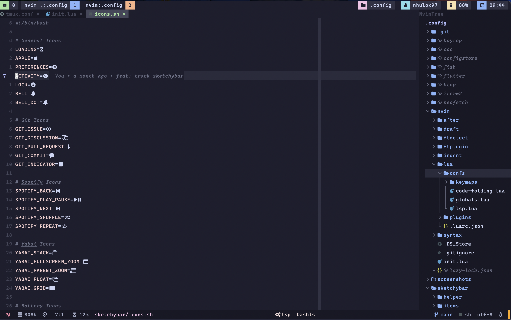
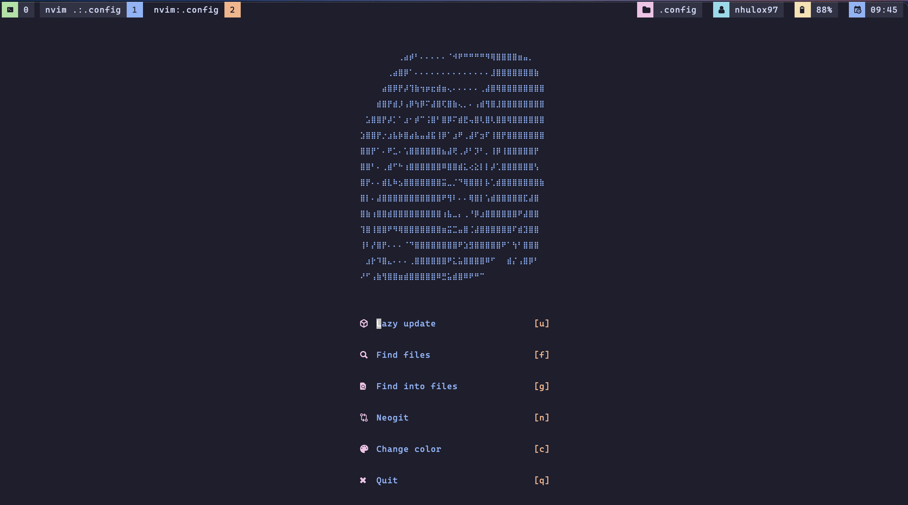

# My .dotfiles

## Purpose

Have a centralized repository where I can find my personal configurations for the dev tools I used the most. Feel free to use them by cloning this repo or downloading the zip files.

## Recommendations

To correctly show icons in your terminal make sure to use some [Nerd Font](https://github.com/ryanoasis/nerd-fonts/releases).

## Screenshots

